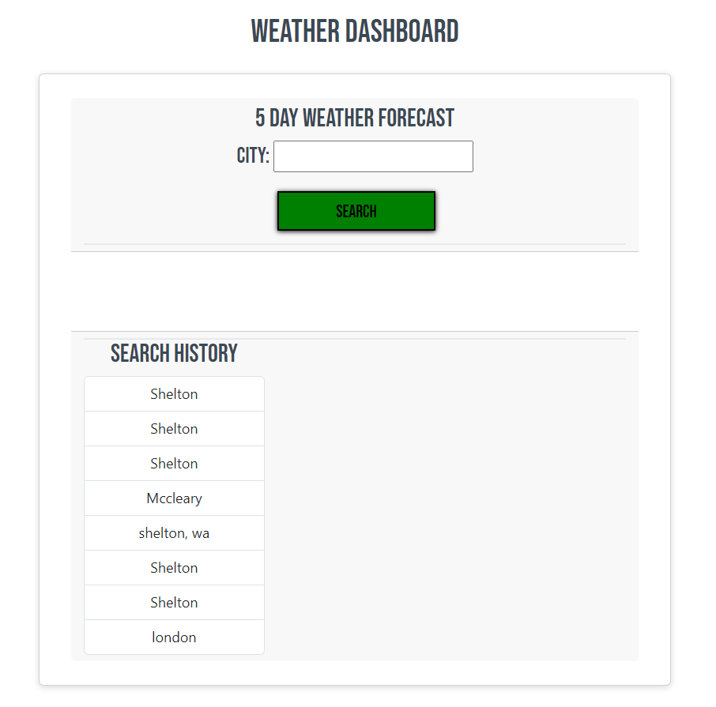

# Weather Dashboard Challenge
_Server-Side APIs Challenge: Weather Dashboard_
* Third-party APIs allow developers to access their data and functionality by making requests with specific parameters to a URL. Developers are often tasked with retrieving data from another application's API and using it in the context of their own. Your challenge is to build a weather dashboard that will run in the browser and feature dynamically updated HTML and CSS.

* Use the 5 Day Weather ForecastLinks to an external site. to retrieve weather data for cities. The base URL should look like the following: https://api.openweathermap.org/data/2.5/forecast?lat={lat}&lon={lon}&appid={API key}. After registering for a new API key, you may need to wait up to 2 hours for that API key to activate.

## Links
* Live URL 

* Portfolio:
[MC Bariekman](https://mcbariekman.github.io/bariekman_portfolio/)

## Usage

